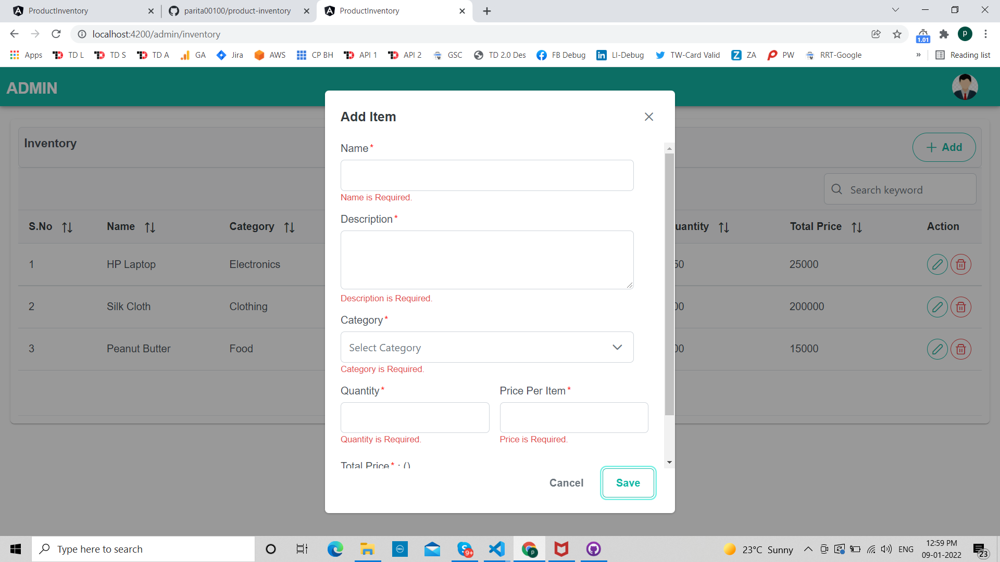
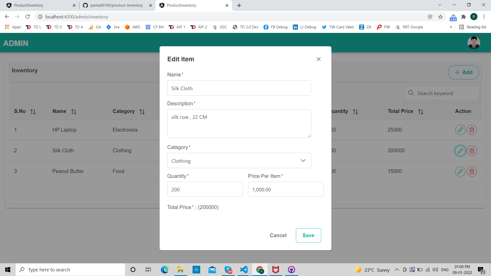

## This project serves the purpose of maintaining the inventory with respect to adding item, updating it and deleting it.

## How to run this project

1. Install Dependency:
`npm install`
It will add or install all dependencies that we use in our project. Make sure you have install angular using `npm install -g @angular/cli`
2. Run Project
`npm start`
It will start a project and run on 4200 port. if you want to view on browser, use this link http://localhost:4200
3. Build a project
`ng build`
It will build the project and compile the files which can deploye on production server.

## Project Overview

This project showcases the UI for maintaining the inventory with respect to grid table. You can Add item from table itself by clicking on Add button. Following are given screenshots as below.

1. Table Overview

2. Add Item

3. Update Item

4. Delete Item

## Time Tracking for this project

1. Boilerplate Construction: 2 Hours
2. Module Decision: 0.5 Hours
3. UI Design: 2 Hours
4. UI Development: 1 Hours
5. Mock Data Integration: 1 Hours
6. Testing: 1 Hours
